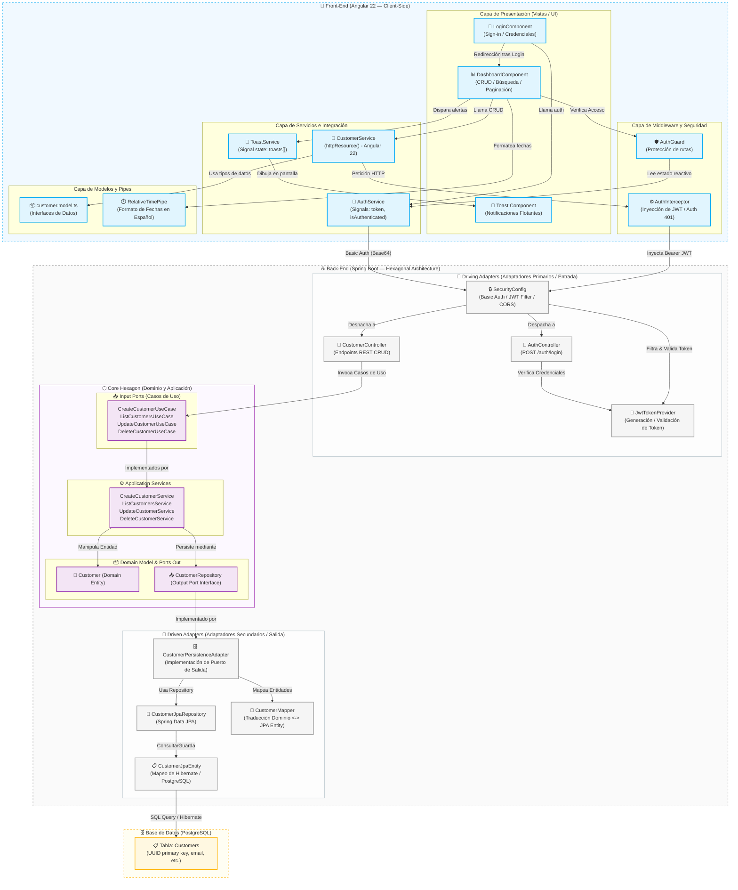

# Diagrama de Arquitectura Lógica de la Aplicación

Este documento detalla la arquitectura de software lógica y la interacción de componentes por capas de la aplicación de gestión de clientes.

## Diagrama de Arquitectura

El siguiente diagrama en Mermaid representa el flujo lógico de información y la división de responsabilidades de las capas del Front-End (Angular 22), el Back-End (Spring Boot) y la Base de Datos (PostgreSQL):

## Descripción de las Capas

### 1. Front-End (Angular 22)
* **Presentación (UI)**: Componentes independientes (`standalone`) configurados con detección de cambios optimizada `ChangeDetectionStrategy.OnPush` para máximo rendimiento y micro-interacciones suaves.
* **Servicios**: Integra la nueva característica **`httpResource()`** de Angular 22 para un manejo de recursos reactivo y simplificado (evitando la suscripción manual y manejando el estado de carga implícitamente).
* **Middleware y Seguridad**: Interceptor funcional que adjunta el token JWT y realiza deslogueo automático ante errores `401`, y un guard que previene accesos no autenticados al dashboard.

### 2. Back-End (Spring Boot — Arquitectura Hexagonal)
* **Adaptadores de Entrada (Driving/Primary Adapters)**:
  - **REST Controllers (`web` package)**: `CustomerController` y `AuthController` actúan como puntos de entrada de la aplicación, traduciendo peticiones HTTP a llamadas lógicas del sistema.
  - **Filtros de Seguridad**: `SecurityConfig` intercepta peticiones, valida credenciales básicas o valida la firma del token JWT a través de `JwtTokenProvider`.
* **Núcleo de la Aplicación (Core Hexagon)**:
  - **Puertos de Entrada (`in` ports)**: Interfaces puras como `CreateCustomerUseCase` y `ListCustomersUseCase` que declaran los servicios disponibles para el exterior.
  - **Servicios de Aplicación**: Clases como `CreateCustomerService` que implementan los casos de uso, orquestando las validaciones y llamando a los puertos de persistencia de salida.
  - **Modelo de Dominio**: La entidad pura `Customer` que encapsula la lógica, atributos y restricciones del dominio de negocio.
  - **Puertos de Salida (`out` ports)**: Interface `CustomerRepository` que declara cómo se deben salvar los datos de manera agnóstica a la tecnología.
* **Adaptadores de Salida (Driven/Secondary Adapters)**:
  - **Persistencia (`persistence` package)**: `CustomerPersistenceAdapter` implementa el puerto de salida `CustomerRepository`. Utiliza `CustomerMapper` para traducir de la entidad pura de dominio a la entidad `CustomerJpaEntity` y se apoya en `CustomerJpaRepository` (Spring Data JPA / Hibernate) para guardar los datos en **PostgreSQL**.

### 3. Base de Datos (PostgreSQL)
* Modelo relacional con identificadores UUID autogenerados en formato estándar para representar de forma única a cada cliente.
