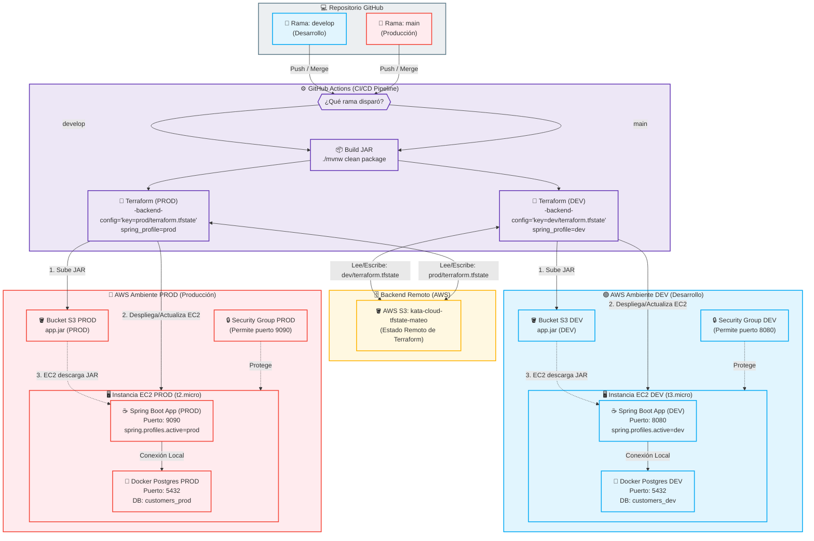

# Diagrama de Despliegue del Proyecto (DEV / PROD)

Este archivo contiene la especificación en Mermaid del flujo de despliegue dinámico continuo (CD) configurado para los ambientes de Desarrollo y Producción.

