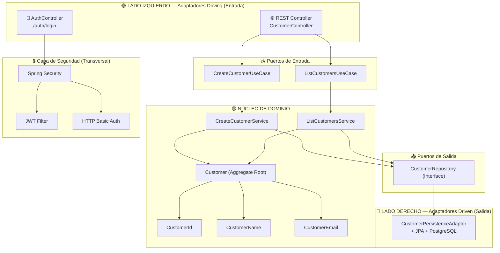
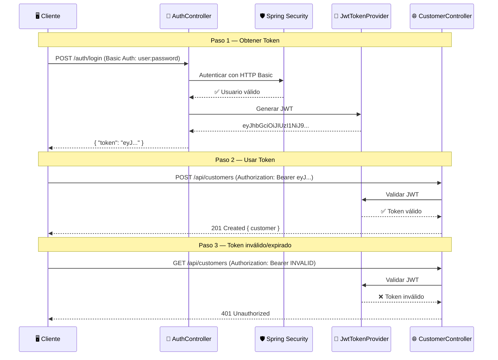

# 🗺️ Hoja de Ruta — Kata Cloud: Ciclo de Vida de una Aplicación

> **Aplicación de registro de clientes** con diferenciación de ambientes (DEV/PROD), arquitectura empresarial y despliegue en la nube.

---

## 📋 Resumen Ejecutivo

| Aspecto | Detalle |
|---|---|
| **Objetivo** | API REST para crear y consultar clientes, ejecutable en modo `dev` y `prod` |
| **Stack** | Java 21, Spring Boot 3.x, PostgreSQL, Docker, Terraform, AWS EC2 |
| **Arquitectura** | Hexagonal + Clean Architecture |
| **Seguridad** | Spring Security + HTTP Basic Auth + JWT |
| **Metodologías** | DDD, TDD, BDD |
| **Testing** | JUnit 5, Cucumber, JMeter |
| **CI/CD** | GitHub Actions → Terraform → AWS EC2 (Free Tier) |

---

## 🏗️ Estructura del Proyecto (Arquitectura Hexagonal + Clean Architecture)

```
kata-cloud-customers/
├── .github/
│   └── workflows/
│       ├── ci.yml                          # Build + Tests
│       └── cd.yml                          # Deploy con Terraform
├── infrastructure/
│   └── terraform/
│       ├── main.tf
│       ├── variables.tf
│       ├── outputs.tf
│       ├── ec2.tf
│       ├── security-groups.tf
│       └── terraform.tfvars.example
├── docker/
│   ├── Dockerfile
│   └── docker-compose.yml
├── docs/
│   ├── architecture.md
│   └── api-specification.md
├── jmeter/
│   └── customers-load-test.jmx
├── Back-End/
│   ├── src/
│   │   ├── main/
│   │   │   ├── java/com/kata/cloud/customers/
│   │   │   │   │
│   │   │   │   │   # ══════════════════════════════════════
│   │   │   │   │   # CAPA DE DOMINIO (núcleo, sin dependencias externas)
│   │   │   │   │   # ══════════════════════════════════════
│   │   │   │   ├── domain/
│   │   │   │   │   ├── model/
│   │   │   │   │   │   ├── Customer.java              # Entidad de dominio (Aggregate Root)
│   │   │   │   │   │   ├── CustomerId.java            # Value Object - ID
│   │   │   │   │   │   ├── CustomerName.java          # Value Object - Nombre
│   │   │   │   │   │   └── CustomerEmail.java         # Value Object - Email
│   │   │   │   │   ├── port/
│   │   │   │   │   │   ├── in/
│   │   │   │   │   │   │   ├── CreateCustomerUseCase.java    # Puerto de entrada
│   │   │   │   │   │   │   └── ListCustomersUseCase.java     # Puerto de entrada
│   │   │   │   │   │   └── out/
│   │   │   │   │   │       └── CustomerRepository.java       # Puerto de salida
│   │   │   │   │   └── exception/
│   │   │   │   │       ├── CustomerAlreadyExistsException.java
│   │   │   │   │       └── InvalidCustomerDataException.java
│   │   │   │   │
│   │   │   │   │   # ══════════════════════════════════════
│   │   │   │   │   # CAPA DE APLICACIÓN (casos de uso / orquestación)
│   │   │   │   │   # ══════════════════════════════════════
│   │   │   │   ├── application/
│   │   │   │   │   ├── service/
│   │   │   │   │   │   ├── CreateCustomerService.java   # Implementa CreateCustomerUseCase
│   │   │   │   │   │   └── ListCustomersService.java    # Implementa ListCustomersUseCase
│   │   │   │   │   └── dto/
│   │   │   │   │       ├── CreateCustomerCommand.java   # Comando de entrada
│   │   │   │   │       └── CustomerResponse.java        # DTO de respuesta
│   │   │   │   │
│   │   │   │   │   # ══════════════════════════════════════
│   │   │   │   │   # CAPA DE INFRAESTRUCTURA (adaptadores)
│   │   │   │   │   # ══════════════════════════════════════
│   │   │   │   ├── infrastructure/
│   │   │   │   │   ├── adapter/
│   │   │   │   │   │   ├── in/
│   │   │   │   │   │   │   └── web/
│   │   │   │   │   │   │       ├── CustomerController.java      # Adaptador REST (driving)
│   │   │   │   │   │   │       ├── AuthController.java          # Endpoint de autenticación
│   │   │   │   │   │   │       └── GlobalExceptionHandler.java  # Manejo global de errores
│   │   │   │   │   │   └── out/
│   │   │   │   │   │       └── persistence/
│   │   │   │   │   │           ├── CustomerJpaEntity.java       # Entidad JPA
│   │   │   │   │   │           ├── CustomerJpaRepository.java   # Spring Data JPA
│   │   │   │   │   │           ├── CustomerPersistenceAdapter.java # Implementa puerto de salida
│   │   │   │   │   │           └── CustomerMapper.java          # Mapeo Dominio ↔ JPA
│   │   │   │   │   ├── config/
│   │   │   │   │   │   ├── BeanConfiguration.java       # Inyección manual de beans de dominio
│   │   │   │   │   │   └── OpenApiConfig.java           # Swagger/OpenAPI
│   │   │   │   │   └── security/
│   │   │   │   │       ├── SecurityConfig.java           # Configuración Spring Security
│   │   │   │   │       ├── JwtTokenProvider.java         # Generación/validación JWT
│   │   │   │   │       ├── JwtAuthenticationFilter.java  # Filtro JWT
│   │   │   │   │       └── BasicAuthConfig.java          # HTTP Basic para /auth/login
│   │   │   │   │
│   │   │   │   └── CustomersApplication.java            # Clase principal
│   │   │   │
│   │   │   └── resources/
│   │   │       ├── application.yml                # Config base
│   │   │       ├── application-dev.yml            # Config DEV (puerto 8080)
│   │   │       └── application-prod.yml           # Config PROD (puerto 9090)
│   │   │
│   │   └── test/
│   │       ├── java/com/kata/cloud/customers/
│   │       │   ├── domain/
│   │       │   │   └── model/
│   │       │   │       └── CustomerTest.java              # Tests unitarios del dominio
│   │       │   ├── application/
│   │       │   │   └── service/
│   │       │   │       ├── CreateCustomerServiceTest.java  # Tests de casos de uso
│   │       │   │       └── ListCustomersServiceTest.java
│   │       │   ├── infrastructure/
│   │       │   │   ├── adapter/
│   │       │   │   │   ├── in/web/
│   │       │   │   │   │   └── CustomerControllerIntegrationTest.java
│   │       │   │   │   └── out/persistence/
│   │       │   │   │       └── CustomerPersistenceAdapterTest.java
│   │       │   │   └── security/
│   │       │   │       └── SecurityIntegrationTest.java
│   │       │   └── bdd/
│   │       │       ├── CucumberTestRunner.java
│   │       │       └── steps/
│   │       │           ├── CreateCustomerSteps.java
│   │       │           └── ListCustomersSteps.java
│   │       └── resources/
│   │           ├── application-test.yml
│   │           └── features/
│   │               ├── create_customer.feature    # Escenarios Gherkin
│   │               └── list_customers.feature
│   ├── pom.xml
│   ├── mvnw
│   ├── mvnw.cmd
│   └── HELP.md
├── .gitignore
├── .env.example
└── README.md
```

---

## 🔀 Diagrama de Arquitectura Hexagonal



---

## 🔒 Flujo de Seguridad (Basic Auth + JWT)



---

## 🚀 Fases de Desarrollo

---

### FASE 0 — Inicialización del Proyecto
> **Duración estimada**: 20 minutos

| # | Tarea | Detalle |
|---|---|---|
| 0.1 | Crear repositorio GitHub | Repo privado `kata-cloud-customers` |
| 0.2 | Generar proyecto Spring Boot | Usar [start.spring.io](https://start.spring.io) o Spring CLI con Java 21 |
| 0.3 | Configurar `pom.xml` | Dependencias iniciales (ver abajo) |
| 0.4 | Crear `.gitignore` | Excluir `target/`, `.env`, `*.jar`, `terraform.tfstate` |
| 0.5 | Crear estructura de paquetes | Según árbol hexagonal definido arriba |
| 0.6 | Crear `README.md` inicial | Instrucciones de build y ejecución |

**Dependencias clave del `pom.xml`:**

```xml
<!-- Core -->
spring-boot-starter-web
spring-boot-starter-data-jpa
spring-boot-starter-validation
spring-boot-starter-security

<!-- Base de datos -->
postgresql (runtime)
h2 (test scope)

<!-- JWT -->
io.jsonwebtoken:jjwt-api:0.12.6
io.jsonwebtoken:jjwt-impl:0.12.6
io.jsonwebtoken:jjwt-jackson:0.12.6

<!-- Testing -->
spring-boot-starter-test
spring-security-test
io.cucumber:cucumber-java:7.x
io.cucumber:cucumber-spring:7.x
io.cucumber:cucumber-junit-platform-engine:7.x

<!-- Documentación -->
springdoc-openapi-starter-webmvc-ui:2.x

<!-- Utilidades -->
org.mapstruct:mapstruct:1.6.x (opcional)
lombok (opcional)
```

---

### FASE 1 — Capa de Dominio (DDD + TDD)
> **Duración estimada**: 30 minutos
> **Metodología**: TDD puro — Primero el test, luego la implementación

#### 🔴 1.1 — Escribir tests del dominio PRIMERO (Red)

```java
// CustomerTest.java — Escribir ANTES de implementar
@Test
void shouldCreateCustomerWithValidData() { ... }

@Test
void shouldRejectEmptyName() { ... }

@Test
void shouldRejectInvalidEmail() { ... }

@Test
void shouldGenerateUniqueId() { ... }
```

#### 🟢 1.2 — Implementar entidades y Value Objects (Green)

| Clase | Tipo DDD | Responsabilidad |
|---|---|---|
| `Customer` | Aggregate Root | Entidad principal con validaciones de negocio |
| `CustomerId` | Value Object | Encapsula UUID, inmutable |
| `CustomerName` | Value Object | Valida nombre no vacío, longitud máxima |
| `CustomerEmail` | Value Object | Valida formato email con regex |

#### 🔵 1.3 — Refactorizar (Refactor)

- Extraer validaciones a los Value Objects
- Asegurar inmutabilidad total
- Aplicar `equals()` y `hashCode()` en Value Objects

#### 1.4 — Definir puertos

```java
// Puerto de entrada (driving)
public interface CreateCustomerUseCase {
    CustomerResponse create(CreateCustomerCommand command);
}

public interface ListCustomersUseCase {
    List<CustomerResponse> listAll();
}

// Puerto de salida (driven)
public interface CustomerRepository {
    Customer save(Customer customer);
    List<Customer> findAll();
    boolean existsByEmail(String email);
}
```

#### 1.5 — Definir excepciones de dominio

| Excepción | Cuándo se lanza |
|---|---|
| `CustomerAlreadyExistsException` | Email duplicado |
| `InvalidCustomerDataException` | Nombre vacío, email inválido |

> [!IMPORTANT]
> La capa de dominio **NO** debe tener ninguna dependencia de Spring, JPA, ni frameworks. Solo Java puro.

---

### FASE 2 — Capa de Aplicación (Casos de Uso + TDD)
> **Duración estimada**: 25 minutos

#### 🔴 2.1 — Tests de los servicios PRIMERO

```java
// CreateCustomerServiceTest.java
@ExtendWith(MockitoExtension.class)
class CreateCustomerServiceTest {

    @Mock
    private CustomerRepository customerRepository;

    @InjectMocks
    private CreateCustomerService service;

    @Test
    void shouldCreateCustomerSuccessfully() { ... }

    @Test
    void shouldThrowWhenEmailAlreadyExists() { ... }
}
```

#### 🟢 2.2 — Implementar servicios de aplicación

| Servicio | Implementa | Lógica |
|---|---|---|
| `CreateCustomerService` | `CreateCustomerUseCase` | Valida unicidad de email → crea `Customer` → persiste via puerto |
| `ListCustomersService` | `ListCustomersUseCase` | Obtiene lista via puerto → mapea a DTOs |

#### 2.3 — DTOs de aplicación

```java
// Comando de entrada
public record CreateCustomerCommand(String name, String email) {}

// Respuesta
public record CustomerResponse(String id, String name, String email,
                                LocalDateTime createdAt) {}
```

---

### FASE 3 — Capa de Infraestructura (Adaptadores)
> **Duración estimada**: 40 minutos

#### 3.1 — Adaptador de persistencia (Driven / Lado derecho)

| Clase | Rol |
|---|---|
| `CustomerJpaEntity` | Entidad JPA con `@Entity`, `@Table`, `@Id` |
| `CustomerJpaRepository` | Interface `JpaRepository<CustomerJpaEntity, UUID>` |
| `CustomerPersistenceAdapter` | Implementa `CustomerRepository` (puerto de salida) |
| `CustomerMapper` | Convierte `Customer` ↔ `CustomerJpaEntity` |

#### 🔴 3.2 — Test de integración de persistencia

```java
@DataJpaTest
@AutoConfigureTestDatabase(replace = Replace.NONE)
@Testcontainers
class CustomerPersistenceAdapterTest {
    @Test
    void shouldSaveAndRetrieveCustomer() { ... }
}
```

#### 3.3 — Adaptador REST (Driving / Lado izquierdo)

```java
@RestController
@RequestMapping("/api/customers")
public class CustomerController {

    @PostMapping
    @ResponseStatus(HttpStatus.CREATED)
    public CustomerResponse create(@Valid @RequestBody CreateCustomerCommand cmd) { ... }

    @GetMapping
    public List<CustomerResponse> listAll() { ... }
}
```

#### 3.4 — Manejo global de errores

```java
@RestControllerAdvice
public class GlobalExceptionHandler {
    // CustomerAlreadyExistsException → 409 Conflict
    // InvalidCustomerDataException  → 400 Bad Request
    // Errores genéricos             → 500 Internal Server Error
}
```

#### 3.5 — Configuración de beans

```java
@Configuration
public class BeanConfiguration {
    @Bean
    public CreateCustomerUseCase createCustomerUseCase(CustomerRepository repo) {
        return new CreateCustomerService(repo);
    }
    // ... demás beans
}
```

---

### FASE 4 — Seguridad (Spring Security + JWT)
> **Duración estimada**: 35 minutos

#### 4.1 — Modelo de seguridad

| Endpoint | Autenticación | Descripción |
|---|---|---|
| `POST /auth/login` | HTTP Basic Auth | Recibe `user:password`, devuelve JWT |
| `POST /api/customers` | Bearer JWT | Requiere token válido para crear |
| `GET /api/customers` | Bearer JWT | Requiere token válido para listar |

#### 4.2 — Implementar componentes de seguridad

| Componente | Responsabilidad |
|---|---|
| `SecurityConfig` | Configuración de filtros, CORS, CSRF, rutas públicas/protegidas |
| `JwtTokenProvider` | Generar token con claims, validar firma y expiración |
| `JwtAuthenticationFilter` | `OncePerRequestFilter` que extrae y valida el Bearer token |
| `BasicAuthConfig` | Configurar usuario/password en properties por ambiente |

#### 4.3 — Configuración por ambiente

```yaml
# application-dev.yml
security:
  jwt:
    secret: dev-secret-key-minimum-256-bits-long-for-hs256
    expiration: 3600000  # 1 hora
  basic:
    username: admin-dev
    password: dev-password-123

# application-prod.yml
security:
  jwt:
    secret: ${JWT_SECRET}  # Variable de entorno en PROD
    expiration: 1800000    # 30 minutos
  basic:
    username: ${BASIC_USER}
    password: ${BASIC_PASSWORD}
```

#### 🔴 4.4 — Tests de seguridad

```java
@SpringBootTest
@AutoConfigureMockMvc
class SecurityIntegrationTest {
    @Test void shouldReturn401WithoutToken() { ... }
    @Test void shouldReturn200WithValidToken() { ... }
    @Test void shouldObtainTokenWithBasicAuth() { ... }
    @Test void shouldReturn401WithExpiredToken() { ... }
}
```

---

### FASE 5 — Configuración de Ambientes y Perfiles
> **Duración estimada**: 15 minutos

#### 5.1 — Archivos de configuración

```yaml
# application.yml (base)
spring:
  application:
    name: kata-cloud-customers
  jpa:
    hibernate:
      ddl-auto: validate
    show-sql: false

---
# application-dev.yml
server:
  port: 8080
spring:
  application:
    name: customers-dev
  datasource:
    url: jdbc:postgresql://localhost:5432/customers_dev
    username: dev_user
    password: dev_password
  jpa:
    hibernate:
      ddl-auto: update
    show-sql: true
logging:
  level:
    com.kata.cloud: DEBUG
app:
  environment-message: "🟢 Ejecutando en DEV"

---
# application-prod.yml
server:
  port: 9090
spring:
  application:
    name: customers-prod
  datasource:
    url: jdbc:postgresql://${DB_HOST}:5432/customers_prod
    username: ${DB_USER}
    password: ${DB_PASSWORD}
  jpa:
    hibernate:
      ddl-auto: validate
    show-sql: false
logging:
  level:
    com.kata.cloud: WARN
app:
  environment-message: "🔴 Ejecutando en PROD"
```

#### 5.2 — Banner de inicio por ambiente

Crear un log al inicio que muestre claramente el ambiente:

```java
@Component
public class StartupLogger implements ApplicationRunner {
    @Value("${app.environment-message}")
    private String envMessage;

    @Value("${server.port}")
    private String port;

    @Override
    public void run(ApplicationArguments args) {
        log.info("============================================");
        log.info("  {} ", envMessage);
        log.info("  Puerto: {}", port);
        log.info("============================================");
    }
}
```

---

### FASE 6 — BDD con Cucumber
> **Duración estimada**: 25 minutos

#### 6.1 — Feature files (Gherkin)

```gherkin
# create_customer.feature
Feature: Creación de clientes
  Como usuario autenticado
  Quiero registrar nuevos clientes
  Para mantener la base de datos actualizada

  Background:
    Given el usuario está autenticado con un token JWT válido

  Scenario: Crear un cliente exitosamente
    When envío una petición POST a "/api/customers" con:
      | name  | email            |
      | Juan  | juan@email.com   |
    Then la respuesta debe tener código 201
    And la respuesta debe contener el nombre "Juan"
    And la respuesta debe contener el email "juan@email.com"

  Scenario: Rechazar cliente con email duplicado
    Given existe un cliente con email "juan@email.com"
    When envío una petición POST a "/api/customers" con:
      | name  | email            |
      | Pedro | juan@email.com   |
    Then la respuesta debe tener código 409

  Scenario: Rechazar cliente con datos inválidos
    When envío una petición POST a "/api/customers" con:
      | name | email       |
      |      | no-es-email |
    Then la respuesta debe tener código 400
```

```gherkin
# list_customers.feature
Feature: Listado de clientes
  Como usuario autenticado
  Quiero ver todos los clientes registrados

  Background:
    Given el usuario está autenticado con un token JWT válido

  Scenario: Listar clientes cuando existen registros
    Given existen los siguientes clientes:
      | name   | email              |
      | Juan   | juan@email.com     |
      | María  | maria@email.com    |
    When envío una petición GET a "/api/customers"
    Then la respuesta debe tener código 200
    And la respuesta debe contener 2 clientes

  Scenario: Listar clientes cuando no existen registros
    When envío una petición GET a "/api/customers"
    Then la respuesta debe tener código 200
    And la respuesta debe contener 0 clientes
```

#### 6.2 — Step Definitions

Implementar `CreateCustomerSteps.java` y `ListCustomersSteps.java` usando `@CucumberContextConfiguration` + `@SpringBootTest`.

---

### FASE 7 — Docker y Docker Compose
> **Duración estimada**: 20 minutos

#### 7.1 — Dockerfile (Multi-stage build)

```dockerfile
# Etapa 1: Build
FROM eclipse-temurin:21-jdk-alpine AS build
WORKDIR /app
COPY pom.xml .
COPY src ./src
RUN apk add --no-cache maven && mvn clean package -DskipTests

# Etapa 2: Runtime
FROM eclipse-temurin:21-jre-alpine
WORKDIR /app
COPY --from=build /app/target/*.jar app.jar

EXPOSE 8080 9090

ENTRYPOINT ["java", "-jar", "app.jar"]
```

#### 7.2 — Docker Compose

```yaml
version: '3.9'
services:
  # --- Base de datos DEV ---
  postgres-dev:
    image: postgres:16-alpine
    environment:
      POSTGRES_DB: customers_dev
      POSTGRES_USER: dev_user
      POSTGRES_PASSWORD: dev_password
    ports:
      - "5432:5432"
    volumes:
      - pgdata-dev:/var/lib/postgresql/data

  # --- Base de datos PROD ---
  postgres-prod:
    image: postgres:16-alpine
    environment:
      POSTGRES_DB: customers_prod
      POSTGRES_USER: ${DB_USER}
      POSTGRES_PASSWORD: ${DB_PASSWORD}
    ports:
      - "5433:5432"
    volumes:
      - pgdata-prod:/var/lib/postgresql/data

  # --- App DEV ---
  app-dev:
    build: .
    environment:
      - SPRING_PROFILES_ACTIVE=dev
    ports:
      - "8080:8080"
    depends_on:
      - postgres-dev

  # --- App PROD ---
  app-prod:
    build: .
    environment:
      - SPRING_PROFILES_ACTIVE=prod
      - DB_HOST=postgres-prod
      - DB_USER=${DB_USER}
      - DB_PASSWORD=${DB_PASSWORD}
      - JWT_SECRET=${JWT_SECRET}
    ports:
      - "9090:9090"
    depends_on:
      - postgres-prod

volumes:
  pgdata-dev:
  pgdata-prod:
```

#### 7.3 — Ejecución

```bash
# Modo DEV
docker compose up app-dev postgres-dev

# Modo PROD
docker compose up app-prod postgres-prod

# Todo junto
docker compose up --build
```

---

### FASE 8 — CI/CD con GitHub Actions + Terraform + AWS EC2
> **Duración estimada**: 40 minutos

#### 8.1 — Pipeline CI (Integración Continua)

```yaml
# .github/workflows/ci.yml
name: CI Pipeline

on:
  push:
    branches: [main, develop]
  pull_request:
    branches: [main]

jobs:
  build-and-test:
    runs-on: ubuntu-latest

    services:
      postgres:
        image: postgres:16-alpine
        env:
          POSTGRES_DB: customers_test
          POSTGRES_USER: test_user
          POSTGRES_PASSWORD: test_password
        ports:
          - 5432:5432
        options: >-
          --health-cmd pg_isready
          --health-interval 10s
          --health-timeout 5s
          --health-retries 5

    steps:
      - uses: actions/checkout@v4

      - name: Setup Java 21
        uses: actions/setup-java@v4
        with:
          distribution: 'temurin'
          java-version: '21'
          cache: 'maven'

      - name: Run Unit Tests
        run: mvn test

      - name: Run Integration Tests
        run: mvn verify -Pintegration-tests

      - name: Run Cucumber BDD Tests
        run: mvn verify -Pbdd-tests

      - name: Build JAR
        run: mvn clean package -DskipTests

      - name: Upload artifact
        uses: actions/upload-artifact@v4
        with:
          name: app-jar
          path: target/*.jar
```

#### 8.2 — Pipeline CD (Despliegue con Terraform)

```yaml
# .github/workflows/cd.yml
name: CD Pipeline - Deploy to AWS

on:
  push:
    branches: [main]

jobs:
  deploy:
    runs-on: ubuntu-latest
    needs: build-and-test

    steps:
      - uses: actions/checkout@v4

      - name: Setup Terraform
        uses: hashicorp/setup-terraform@v3
        with:
          terraform_version: 1.9.x

      - name: Configure AWS Credentials
        uses: aws-actions/configure-aws-credentials@v4
        with:
          aws-access-key-id: ${{ secrets.AWS_ACCESS_KEY_ID }}
          aws-secret-access-key: ${{ secrets.AWS_SECRET_ACCESS_KEY }}
          aws-region: us-east-1

      - name: Download JAR artifact
        uses: actions/download-artifact@v4
        with:
          name: app-jar
          path: ./target

      - name: Terraform Init
        run: terraform init
        working-directory: infrastructure/terraform

      - name: Terraform Plan
        run: terraform plan -out=tfplan
        working-directory: infrastructure/terraform

      - name: Terraform Apply
        run: terraform apply -auto-approve tfplan
        working-directory: infrastructure/terraform
```

#### 8.3 — Terraform para EC2 Free Tier

```hcl
# infrastructure/terraform/ec2.tf
resource "aws_instance" "app_server" {
  ami           = data.aws_ami.amazon_linux_2023.id
  instance_type = "t2.micro"  # Free Tier elegible

  key_name               = var.key_pair_name
  vpc_security_group_ids = [aws_security_group.app_sg.id]

  user_data = templatefile("${path.module}/user-data.sh", {
    db_host     = var.db_host
    db_user     = var.db_user
    db_password = var.db_password
    jwt_secret  = var.jwt_secret
    profile     = "prod"
  })

  tags = {
    Name        = "kata-cloud-customers"
    Environment = "prod"
  }
}

resource "aws_security_group" "app_sg" {
  name = "kata-cloud-sg"

  # SSH
  ingress {
    from_port   = 22
    to_port     = 22
    protocol    = "tcp"
    cidr_blocks = [var.my_ip]
  }

  # App PROD
  ingress {
    from_port   = 9090
    to_port     = 9090
    protocol    = "tcp"
    cidr_blocks = ["0.0.0.0/0"]
  }

  egress {
    from_port   = 0
    to_port     = 0
    protocol    = "-1"
    cidr_blocks = ["0.0.0.0/0"]
  }
}
```

#### 8.4 — User Data Script (EC2 bootstrap)

```bash
#!/bin/bash
# user-data.sh
yum update -y
yum install -y java-21-amazon-corretto docker postgresql16

# Instalar y levantar PostgreSQL o usar RDS Free Tier
systemctl start docker
systemctl enable docker

# Copiar JAR y ejecutar
aws s3 cp s3://kata-cloud-artifacts/app.jar /opt/app/app.jar

# Ejecutar la aplicación
java -jar /opt/app/app.jar \
  --spring.profiles.active=${profile} \
  --spring.datasource.url=jdbc:postgresql://${db_host}:5432/customers_prod \
  --spring.datasource.username=${db_user} \
  --spring.datasource.password=${db_password} \
  --security.jwt.secret=${jwt_secret}
```

---

### FASE 9 — Performance Testing con JMeter
> **Duración estimada**: 15 minutos

#### 9.1 — Plan de pruebas JMeter

| Test | Endpoint | Threads | Ramp-Up | Loops | Objetivo |
|---|---|---|---|---|---|
| Crear clientes | `POST /api/customers` | 50 | 10s | 5 | Validar creación bajo carga |
| Listar clientes | `GET /api/customers` | 100 | 10s | 10 | Validar lectura bajo carga |
| Autenticación | `POST /auth/login` | 30 | 5s | 3 | Validar login bajo carga |

#### 9.2 — Ejecución headless

```bash
jmeter -n -t jmeter/customers-load-test.jmx \
       -l jmeter/results.jtl \
       -e -o jmeter/report/
```

---

## 📅 Cronograma Consolidado

```mermaid
gantt
    title Cronograma de Desarrollo — Kata Cloud Customers
    dateFormat  HH:mm
    axisFormat  %H:%M

    section Fase 0 — Setup
    Repo + Spring Initializr + pom.xml     :f0, 00:00, 20min

    section Fase 1 — Dominio (TDD)
    Tests dominio + Entidades + VOs        :f1, after f0, 30min

    section Fase 2 — Aplicación (TDD)
    Tests servicios + Casos de uso         :f2, after f1, 25min

    section Fase 3 — Infraestructura
    Adaptadores REST + JPA + Config        :f3, after f2, 40min

    section Fase 4 — Seguridad
    Spring Security + JWT + Basic Auth     :f4, after f3, 35min

    section Fase 5 — Perfiles
    application-dev/prod.yml + Validación  :f5, after f4, 15min

    section Fase 6 — BDD
    Features Gherkin + Step Definitions    :f6, after f5, 25min

    section Fase 7 — Docker
    Dockerfile + Docker Compose            :f7, after f6, 20min

    section Fase 8 — CI/CD + AWS
    GitHub Actions + Terraform + EC2       :f8, after f7, 40min

    section Fase 9 — Performance
    JMeter tests                           :f9, after f8, 15min
```



| Fase | Descripción | Duración |
|------|-------------|----------|
| **Fase 0** | Inicialización del proyecto | 20 min |
| **Fase 1** | Capa de Dominio (TDD) | 30 min |
| **Fase 2** | Capa de Aplicación (TDD) | 25 min |
| **Fase 3** | Capa de Infraestructura | 40 min |
| **Fase 4** | Seguridad (JWT + Basic Auth) | 35 min |
| **Fase 5** | Configuración de ambientes | 15 min |
| **Fase 6** | BDD con Cucumber | 25 min |
| **Fase 7** | Docker y Docker Compose | 20 min |
| **Fase 8** | CI/CD + Terraform + AWS | 40 min |
| **Fase 9** | Performance Testing (JMeter) | 15 min |
| | **TOTAL** | **~4 horas 25 min** |

---

## ✅ Checklist de Verificación Final

- [ ] `POST /api/customers` crea un cliente correctamente
- [ ] `GET /api/customers` retorna la lista de clientes
- [ ] La app inicia en puerto **8080** con perfil `dev`
- [ ] La app inicia en puerto **9090** con perfil `prod`
- [ ] Los mensajes de log difieren entre ambientes
- [ ] `POST /auth/login` con Basic Auth devuelve un JWT
- [ ] Los endpoints `/api/**` requieren Bearer JWT
- [ ] Los tests unitarios pasan (`mvn test`)
- [ ] Los tests de integración pasan (`mvn verify`)
- [ ] Los escenarios Cucumber pasan
- [ ] `docker compose up` levanta la aplicación completa
- [ ] `mvn clean package` genera el JAR ejecutable
- [ ] El pipeline CI ejecuta tests y genera artefacto
- [ ] Terraform despliega la instancia EC2
- [ ] La aplicación es accesible desde la IP pública de EC2
- [ ] No hay credenciales reales en el repositorio
- [ ] `.gitignore` excluye archivos sensibles

---

## ⚠️ Consideraciones de Seguridad (del PDF)

> [!CAUTION]
> **No subir credenciales reales** ni secretos a repositorios públicos. Usar repositorios personales, no del banco. Todas las claves y contraseñas en los ejemplos deben ser ficticias.

- Usar **GitHub Secrets** para credenciales de AWS y base de datos
- Usar **`.env.example`** con valores placeholder (nunca `.env` real en el repo)
- Configurar **`git-secrets`** como hook pre-commit
- Usar variables de entorno en PROD, nunca valores hardcoded

---

## User Review Required

> [!IMPORTANT]
> **Decisiones que requieren tu validación antes de comenzar:**
>
> 1. **Base de datos en AWS**: ¿Usar PostgreSQL dentro del mismo EC2 (más simple, todo Free Tier) o crear un RDS Free Tier separado (más profesional pero más complejo con Terraform)?
> 2. **Usuarios de autenticación**: ¿Los usuarios de Basic Auth se almacenan en properties (in-memory) o prefieres una tabla `users` en la BD con roles?
> 3. **Migración de esquema**: ¿Incluir **Flyway** o **Liquibase** para versionado de esquema de BD, o es suficiente con `ddl-auto: update`?
> 4. **Documentación de API**: ¿Incluir **Swagger/OpenAPI** con SpringDoc?

## Open Questions

> [!NOTE]
> - ¿Deseas que comience la implementación con alguna fase en particular?
> - ¿Hay algún aspecto del reto que quieras priorizar o modificar?
